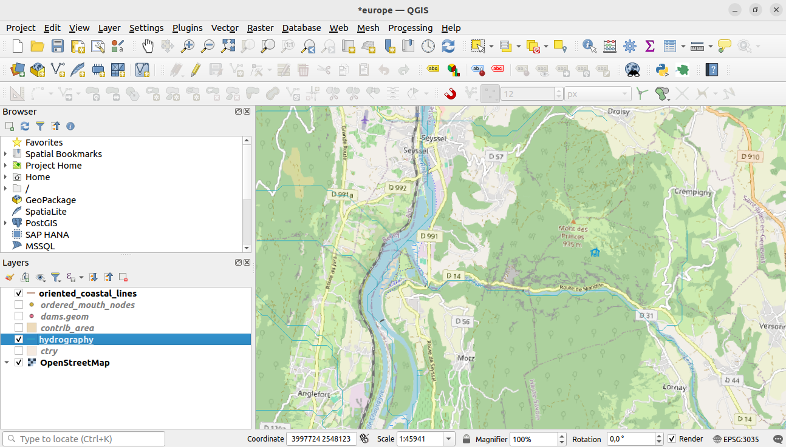

Desktop Client
==============

The desktop client was developed as a Python QGIS plugin, called Upstream Downstream, to be used in a project where the hydrography, coastlines and other spatial features incorporated into the PostHydro database can be displayed and queried upstream or downstream of any point on the hydrography.

 .. |app-icon| image:: images/icon.png
       :width: 23px
       :alt: Upstream Downstream icon

A QGIS project should be created, based on the PostHydro database of the region of interest, with the hydrography layer, other layers of interest such as the oriented_coastal_lines and layers of the hydroreferenced spatial and point features, plus other publicly available features of interest, such as OpenStreetMap, for example. The plugin works as a new tool, whose icon is |app-icon|. To use the tool the hydrography layer should be selected and the tool icon clicked.

Once a hydrography reach is clicked with the tool, the application locates the point, in terms of the river name (if available) and distance along the streams to river and basin mouth, and displays a list of database available hydroreferenced features, taken from the information_application table, on the local idiom of the computer (if the idiom is not available in information_application table, in english):

After selecting one or more of the features, as shown below, and clicking ok, the application queries the database and display the results as new QGIS layers.

The results of the queries are shown as additional layers in the QGIS project, referenced to the reach id of the point. Those that have a geographical expression are shown in the map window.

The spatial features queries results, that are expressed as tables, as well as details of the selected point features results, can be shown as table attributes of the corresponding layers.

The desktop client, a QGIS Python plugin, implements a number of methods, in a class called UpstreamDownstreamTool:

The first, canvasPressEvent, responds to the click on a hydrography reach by identifying the reach and opening a window that displays the location of of the reach in its basin and the possible hydroreferenced queries you can submit to the database, taken from the contents of the information_application table.

The minimum content of the table refers to queries for the watershed upstream of the reach elementary contributing area, the reaches upstream of the chosen reach and the main path downstream. If the hydrography topology of the region allows for divergences at the hydrography nodes, a register to display all possible downstream paths will also be present on the information_application table. The other optional registers refer to the point and spatial features that have been hydroreferenced in the database. For every point feature referenced in the database two options of queries will be available in the information_application table: feature elements upstream and downstream. For every spatial feature hydroreferenced in the database, a register to display the feature upstream of the chosen reach will be present on the information_application table.

The remaining methods are the ones that implement the chosen queries displayed by the canvasPressEvent method. Each one of the basic queries (to display downstream paths and upstream areas and reaches) has its specific method (generateWatershed, generateMainStreamDown, generateUpstreamReaches and generateCompletePathDownstream). The ones to display point features down and upstream and spatial features upstream (generateDownstreamPointFeatures, generateUpstreamPointFeatures and generateUpstreamSpatialFeatures) are generic methods, independent of the specific feature involved. The parameters that discriminate the specific feature involved (table names) are presented to the methods as arguments, taken from the corresponding information_application table register. Actually, the very name of the method to be called is taken from the corresponding register of the table. The method calls corresponding to the selected information items on the displayed table are handled by canvasPressEvent by the same code, regardless of the item, so everything (method name and method arguments) has to be extracted from the corresponding register of the application_information table, even if some of the arguments may not be applicable to the specific method involved, in which case they appear as Null on the table.

Methods
-------

.. function:: UpstreamDownstreamTool.tr(self, message)

   Get the translation for a string using Qt translation API.
   
   :param message: String for translation.
   :type message: str, QString
   
   :returns: Translated version of message.
   :rtype: QString
   

---

.. function:: UpstreamDownstreamTool.canvasPressEvent(self, e)

   React to clicking on the canvas.
   
   :param e: Mouse click event.
   :type e: event, QMouseEvent
   

---

.. function:: UpstreamDownstreamTool.generateWatershed(self, reachid, areaid, pfcode, dist, title, tablename, nonaccum_tbl, key_table, description_name, value_name, ismainrch)

   Generate a new layer with the set of upstream contributing areas.
   
   :param reachid: Selected reach id.
   :type reachid: int
   :param areaid: Selected reach contributing area id.
   :type areaid: int
   :param pfcode: pfcode: Selected reach Pfafstetter code.
   :type pfcode: str
   :param dist: Selected reach distance to the basin mouth.
   :type dist: float
   :param title: Feature of interest in locale (or default english) language.
   :type title: str
   :param tablename: Not applicable in this context.
   :type tablename: str
   :param nonaccum_tbl: Not applicable in this context.
   :type nonaccum_tbl: str
   :param key_table: Not applicable in this context.
   :type key_table: str
   :param description_name: Not applicable in this context.
   :type description_name: str
   :param value_name: Not applicable in this context.
   :type value_name: str
   :param ismainrch: Selected reach main reach flag.
   :type ismainrch: bool
   

---

.. function:: UpstreamDownstreamTool.generateMainStreamDown(self, reachid, areaid, pfcode, dist, title, tablename, nonaccum_tbl, key_table, description_name, value_name, ismainrch)

   Generate a new layer with the set of downstream reaches along the main path.
   
   :param reachid: Selected reach id.
   :type reachid: int
   :param areaid: Selected reach contributing area id.
   :type areaid: int
   :param pfcode: pfcode: Selected reach Pfafstetter code.
   :type pfcode: str
   :param dist: Selected reach distance to the basin mouth.
   :type dist: float
   :param title: Feature of interest in locale (or default english) language.
   :type title: str
   :param tablename: Not applicable in this context.
   :type tablename: str
   :param nonaccum_tbl: Not applicable in this context.
   :type nonaccum_tbl: str
   :param key_table: Not applicable in this context.
   :type key_table: str
   :param description_name: Not applicable in this context.
   :type description_name: str
   :param value_name: Not applicable in this context.
   :type value_name: str
   :param ismainrch: Selected reach main reach flag.
   :type ismainrch: bool
   

---

.. function:: UpstreamDownstreamTool.generateUpstreamReaches(self, reachid, areaid, pfcode, dist, title, tablename, nonaccum_tbl, key_table, description_name, value_name, ismainrch)

   Generate a new layer with the set of upstream reaches.
   
   :param reachid: Selected reach id.
   :type reachid: int
   :param areaid: Selected reach contributing area id.
   :type areaid: int
   :param pfcode: pfcode: Selected reach Pfafstetter code.
   :type pfcode: str
   :param dist: Selected reach distance to the basin mouth.
   :type dist: float
   :param title: Feature of interest in locale (or default english) language.
   :type title: str
   :param tablename: Not applicable in this context.
   :type tablename: str
   :param nonaccum_tbl: Not applicable in this context.
   :type nonaccum_tbl: str
   :param key_table: Not applicable in this context.
   :type key_table: str
   :param description_name: Not applicable in this context.
   :type description_name: str
   :param value_name: Not applicable in this context.
   :type value_name: str
   :param ismainrch: Selected reach main reach flag.
   :type ismainrch: bool
   

---

.. function:: UpstreamDownstreamTool.generateCompletePathDownstream(self, reachid, areaid, pfcode, dist, title, tablename, nonaccum_tbl, key_table, description_name, value_name, ismainrch)

   Generate a new layer with the set of downstream reaches along the main path and divergences.
   
   :param reachid: Selected reach id.
   :type reachid: int
   :param areaid: Selected reach contributing area id.
   :type areaid: int
   :param pfcode: pfcode: Selected reach Pfafstetter code.
   :type pfcode: str
   :param dist: Selected reach distance to the basin mouth.
   :type dist: float
   :param title: Feature of interest in locale (or default english) language.
   :type title: str
   :param tablename: Not applicable in this context.
   :type tablename: str
   :param nonaccum_tbl: Not applicable in this context.
   :type nonaccum_tbl: str
   :param key_table: Not applicable in this context.
   :type key_table: str
   :param description_name: Not applicable in this context.
   :type description_name: str
   :param value_name: Not applicable in this context.
   :type value_name: str
   :param ismainrch: Selected reach main reach flag.
   :type ismainrch: bool
   

---

.. function:: UpstreamDownstreamTool.generateDownstreamPointFeatures(self, reachid, areaid, pfcode, dist, title, tablename, nonaccum_tbl, key_table, description_name, value_name, ismainrch)

   Generate a new layer with the set of a point feature elements directly on reaches along the main path downstream.
   
   :param reachid: Selected reach id.
   :type reachid: int
   :param areaid: Selected reach contributing area id.
   :type areaid: int
   :param pfcode: pfcode: Selected reach Pfafstetter code.
   :type pfcode: str
   :param dist: Selected reach distance to the basin mouth.
   :type dist: float
   :param title: Feature of interest in locale (or default english) language.
   :type title: str
   :param tablename: Point feature table name.
   :type tablename: str
   :param nonaccum_tbl: Not applicable in this context.
   :type nonaccum_tbl: str
   :param key_table: Not applicable in this context.
   :type key_table: str
   :param description_name: Not applicable in this context.
   :type description_name: str
   :param value_name: Not applicable in this context.
   :type value_name: str
   :param ismainrch: Selected reach main reach flag.
   :type ismainrch: bool
   

---

.. function:: UpstreamDownstreamTool.generateUpstreamPointFeatures(self, reachid, areaid, pfcode, dist, title, tablename, nonaccum_tbl, key_table, description_name, value_name, ismainrch)

   Generate a new layer with the set of a point feature elements on reaches upstream.
   
   :param reachid: Selected reach id.
   :type reachid: int
   :param areaid: Selected reach contributing area id.
   :type areaid: int
   :param pfcode: pfcode: Selected reach Pfafstetter code.
   :type pfcode: str
   :param dist: Selected reach distance to the basin mouth.
   :type dist: float
   :param title: Feature of interest in locale (or default english) language.
   :type title: str
   :param tablename: Point feature table name.
   :type tablename: str
   :param nonaccum_tbl: Not applicable in this context.
   :type nonaccum_tbl: str
   :param key_table: Not applicable in this context.
   :type key_table: str
   :param description_name: Not applicable in this context.
   :type description_name: str
   :param value_name: Not applicable in this context.
   :type value_name: str
   :param ismainrch: Selected reach main reach flag.
   :type ismainrch: bool
   

---

.. function:: UpstreamDownstreamTool.generateUpstreamSpatialFeatures(self, reachid, areaid, pfcode, dist, title, tablename, nonaccum_tbl, key_table, description_name, value_name, ismainrch)

   Generate a table layer with feature element - value pairs describing upstream characteristics of a spatial feature.
   
   :param reachid: Selected reach id.
   :type reachid: int
   :param areaid: Selected reach contributing area id.
   :type areaid: int
   :param pfcode: pfcode: Selected reach Pfafstetter code.
   :type pfcode: str
   :param dist: Selected reach distance to the basin mouth.
   :type dist: float
   :param title: Feature of interest in locale (or default english) language.
   :type title: str
   :param tablename: Spatial feature accumulated value table name.
   :type tablename: str
   :param nonaccum_tbl: Spatial feature non accumulated value table name.
   :type nonaccum_tbl: str
   :param key_table: Spatial feature key table name.
   :type key_table: str
   :param description_name: Spatial feature table feature descriptor in locale (or default english) language.
   :type description_name: str
   :param value_name: Spatial feature table value descriptor in locale (or default english) language.
   :type value_name: str
   :param ismainrch: Selected reach main reach flag.
   :type ismainrch: bool
   

---
