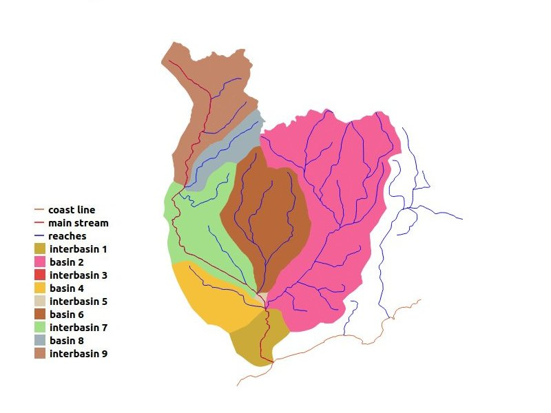
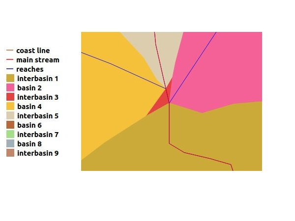

Pfafstetter Coding
==================

Back in 1989 a Brazilian engineer named Otto Pfafstetter conceived and published, as an internal report of the government department where he worked, a new structured basin coding system in which the most important watershed characteristics were captured: its size (contributing area), and its relative hierarchy (upstream or downstream). This coding method gained a wider audience when published in 1999 by two USGS engineers, Kristin and James Verdin, on a Journal of Hydrology paper, and has been adopted worldwide since then.

With just one decimal digit we can display the largest and most important sub-basins of a watershed, with explicit topology expression - the lower the digit, the most downstream is the sub-basin. More detailed division of each area can be done by similar additional steps applied to each sub-basin, each one adding a new digit to the right of the previous code.

Pfafstetter coding attributes to a group of reaches between two confluence nodes two codes, one related to the main stream where the reaches belong (pfcodestr) and the other, unique to each such group, expressing their contributing area code according to the Pfafstetter coding criteria (pfcode). The latter, when taken together with the distance of the reach upstream point to the mouth of the basin, consists in a unique topological identifier for each of the represented reaches.

The first part of the Pfafstetter basin coding involves tracing its main stream. Starting at the mouth node, reaches are followed upstream, always taking as main stream on a confluence node the reach with the greatest upstream contributing area. The main stream reaches take as pfcodestr the code of the basin being divided. At each confluence point on the main stream we have a tributary sub-basin. In the final part, the four largest of them are coded, from the most downstream up, as 2, 4, 6 and 8, by adding those digits to the right of the basin code. The odd sub-basins, called interbasins, contributing directly to the main stream, are likewise coded. The one downstream of sub-basin 2 gets code 1, the one between sub-basins 2 and 4 code 3, and so on. Interbasin 9 is the area upstream of sub-basin 8 confluence.

The figure below shows a basin classified according to Pfafstetter

We can notice that interbasin 3 does not show in the picture. The reason, shown in the detailed view below, is that the confluence points of basins 2 and 4 on the main stream are close, so interbasin 3 is much smaller than the other areas.

Pfafstetter has shown that his concepts could be applied in a continental scale, by considering the coast line as some kind of a main stream, flowing counterclockwise to some point on the north of the continent, with all proper basins as left bank tributaries. According to Pfafstetter, the endorheic basins, flowing to internal lakes or seas, would get code 0.

This extension of the basin concept to a continent of course does not reflect proper upstream-downstream relationship, but just proximity. This idea was further extended in PostHydro, to accomodate for islands and inner seas, by aggregating their coastlines as one single composite line, connected at the individual coastlines nearest points. This new approach, first applied to the European continent and European Union, is what makes possible the coding of all of the continent's reaches, on the continent itself or on its islands, whether flowing to the sea or on endorheic basins, with a unique code for every represented river reach group between two confluence points. 

