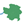

# Upstream Downstream Plugin

The Upstream Downstream Plugin represents an added value to a hydrography database, by introducing the capability of querying spatial and stream related information, upstream or downstream of a chosen point in the hydrography, by fast, ordinary, non-spatial queries in the database.

In order to be able to provide this capability the stream reaches table in the hydrography database has to be indexed by adding two string fields, which are the [Pfafstetter code](https://en.wikipedia.org/wiki/Pfafstetter_Coding_System) of the reach and of the mainstream to which it belongs. By simple interpretation of the code, queries have been developed and can be incorporated to the database, providing the set of reaches upstream and downstream of the one that was chosen. Stream related features can be queried as well, provided they have been associated to their corresponding stream reach and their distance downstream to the basin's mouth.

If to the database is added a table with directly contributing areas to the individual reaches, or of a group thereof, the plugin can display the chosen reach's watershed, as well as any other spatial information upstream, provided this information has been crossed with the contributing areas and accumulated, using the database's upstream querying capability.

Databases displaying this combination of connected stream reaches and of their spatial counterpart, the directly contributing areas, have been developed in many regions of the world, as for example in the United States, NHDPlus, in Europe, Ecrins database, in Australia, Geofabric, or in Brazil, Base Hidrográfica Ottocodificada. Such bases can easily be prepared to use the Upstream Downstream Plugin capability.

# Using the Upstream Downstream Plugin

To use the plugin you have to select it, by clicking on the plugin logo  , and select the hydrography (stream reaches) layer on QGIS.

Once you click on any of the reaches shown on the canvas, a table is presented, identifying the reach (reach code, river name, distance to its basin mouth and area upstream) and presenting a list of information available in the database, upstream or downstream of the reach (only stream related features can be queried downstream), on which you can select one or more features.

Once you click OK, layers representing the requested information in terms of simple tables or of geographical features layers with their corresponding attribute tables are added to the project.
